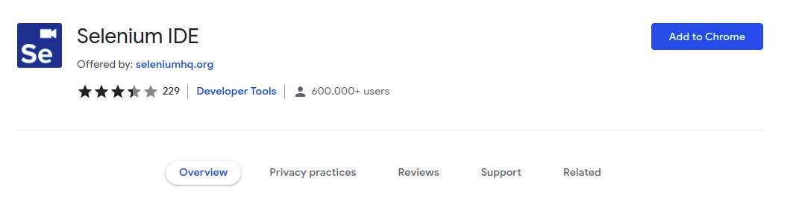
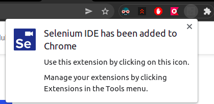
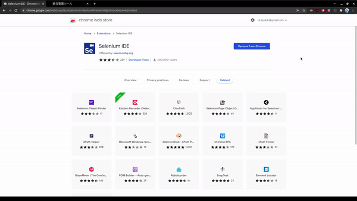
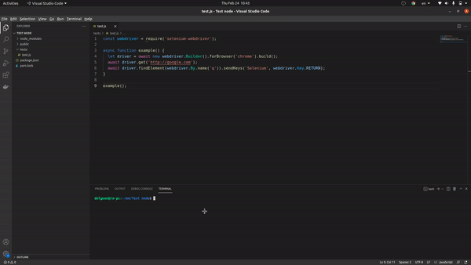
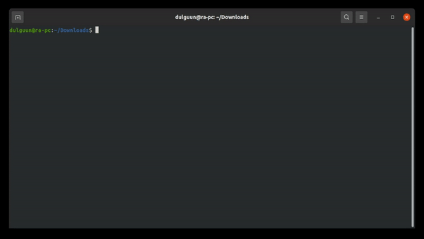

# Table of Contents

1. [Selenium IDE](#selenium-ide)
1. [Selenium Webdriver](#selenium-webdriver)
1. [Selenium Webdriver on NodeJS](#selenium-webdriver-setup-for-nodejs)
1. [Selenium Webdriver on PHP (ubuntu)](#php-selenium-webdriver-setup-on-ubuntu)

# Selenium IDE

## Intro

Selenium нь HTML тагууд дээр суурилан UI элементүүдийг, контент байгаа эсэхийг, товчнууд ажиллаж байгааг, оролт, сонголт, хүснэгтийн нүднүүд зэрэг бөглөгдөж байгаа, дэлгэцийн хэмжээ, маузийн сонголтууд, анхааруулга зэрэг маш олон зүйлсийг шалгах боломжтой автоматжуулсан хэрэглүүр юм.

Үндсэн ажиллагаа нь Selenium-ийн extension-ээс record хийж тест хийх газраа үйлдлүүдээ хийгээд stop record дарснаар record хийж байсан үед хийгдэж байсан үйлдлүүд хадгалагдана. Үүний дараа хадгалагдсан үйлдлүүдээрээ run test хийхэд бүх үйлдлийг хийх үндсэн ажиллагаатай.

Бүх үйлдлүүдээ бичиж авсны дараа дунд нь код дэбаг хийдэг шиг breakpoint тавьж тест хийх мөн боломжтой.

Мөн selenium дээр скрипт бичиж түүнийгээ ажиллуулах боломжтой
Жишээ нь: `return Math.random(). toString(36).substring(2,12)`

## Selenium суулгах

1. [https://www.selenium.dev/selenium-ide/](Download selenium)

      Дээрх линкээр орж ямар хөтөч ашиглаж байгаагаас хамаараад суулгана

1. Add to Chrome -> Add extension дарж хөтөчдөө суулгана

      

1. Амжилттай суулгасан бол таны хөтөчид доорх байдлаар орж ирсэн байна.

      

1. Selenium IDE-г ашиглаж байгаа байдал

      

## Selenium-ийн талаар илүү

Гурван төрлийн коммандууд байдаг.

1. [Actions - Үйлдлүүд](#actions)
1. [Accessors - Хандагч](#accessors)
1. [Assertions - Баталгаажуулалт](#assertions)

## Actions

Actions нь ихэвчлэн товч, линк дарах, сонголт хийх, оролтод юм бичих зэрэг орно. Харин алдаа гарвал тест шууд зогсоно.

### Actions-ийн ихэвчлэн ашиглагддаг коммандууд

| Комманд | Тайлбар  |
|---|---|
| open(url) | url нээнэ |
| type (locator, value) | input field-д утга оруулна |
| typeKeys (locator,value) | элемент-д keyboard-оос оруулж болох зүйлсийг хийнэ |
| click (locator) | link, button, checkbox, radiobox гэх мэт ихэнх зүйлсийг дарахад ашигладаг |
| clickAt (locator,coordString) | Байршлыг оруулж дарах үйлдэл |
| clickAndWait (locator) | Дараад хүлээх |
| doubleClick (locator) | Хулганы хоёр товшилт |
| focus (locator) | фокус шилжүүлэх |
| close() | Браузэр эсвэл цонхны хаах товчийг дарах |
| waitForCondition (script,timeout) | ямар нэгэн нөхцлийг true болтол хүлээх |
| waitForPageToLoad (script,timeout) | хуудсыг уншиж дуусахыг хүлээх |
| waitForElementPresent (script,timeout) | элемент гарч иртэл хүлээх |
| chooseOkOnNextConfirmation (script,timeout) | ok, cancel-тай alert box-ноос ok дарах |
| chooseCancelOnNextConfirmation (script,timeout) | cancel дарах |

## Accessors

Accessor-т ихэвчлэн хуудсын ямар нэгэн төлөв дэх утгуудыг хувьсагчид хадгалдаг. Мөн өөрөөр баталгаажуулалтыг автоматаар үүсгэхэд ашиглагддаг. Нөгөө 2-оо бодвол цөөн ашиглагддаг.

### Accessors-ийн ихэвчлэн ашиглагддаг коммандууд

| Комманд | Тайлбар  |
|---|---|
| storeTitle (variableName) | Одоо байгаа хуудсын title хадгалах |
| storeText (locator, variableName) | Элементийн текст авах |
| storeValue (locator,variableName) | input field-ийн утгыг хадгалах |
| storeLocation (variableName) | Одоо байгаа хуудсын бүтэн URL-ийг хадгалах |
| storeElementIndex (locator, variableName) | Элементийн индексийг хадгалах |
| storeBodyText (variableName) | Хуудсын бүх зүйлийг хадгалах |
| storeAllButtons (variableName) | Хуудсанд байгаа товчнуудын id-г авч хадгалах |
| storeAllFields (variableName) | Хуудсанд байгаа fieldүүдийн id-г авч хадгалах |
| storeAllLinks (variableName) | Хуудсан байгаа линкүүдийн id-г авч хадгалах |

## Assertions

Assertion-д хуудсын ямар нэг төлвийг баталгаажуулахад ашигладаг. Үндсэндээ гурван төлвүүдэд ашиглагддаг. Үүнд: assert, verify, waitfor байна.

### Assertions-ийн ихэвчлэн ашиглагддаг коммандууд

| Комманд | Тайлбар  |
|---|---|
| assertText | Элементийн текст тохирч байгааг шалгах |
| assertTitle | Хуудсын title тохирч байгааг шалгах |
| assertElementPresent | Хуудсанд элемент байгаа эсэхийг шалгах |
| assertTextPresent | Элемент-д текст байгаа эсэхийг шалгах |
| verifyTitle | Title байгаа эсэхийг шалгах |
| verifyElementPresent | Элемент байгаа эсэхийг шалгах  |
| verifyTextPresent | Элемент-д текст байгаа эсэхийг шалгах |
| verifyBodyText(pattern) | Хуудсан дах текст таарч байгааг шалгах |
| verifyAttribute(attributeLocator, pattern) | Элементийн аттрибут таарч байгааг шалгах |
| waitForErrorOnNext (message) | Алдаа гарсан эсэхийг хүлээх |
| waitForAlert (pattern) | Анхааруулга хүлээх |


# Selenium webdriver

## Intro

Webdriver сангаа суулгасны дараа оруулж ирэн хамгийн эхэнд хийх зүйл нь capabilities-ийг тодорхойлох. Үүнд: Shared, Chromium(Chrome, Chromium, Edge), Firefox, IE, Safari зэрэг багтана. [[1]](https://www.selenium.dev/documentation/webdriver/capabilities/)

## Basic commands

- get функц

      URL өгч хуудас руу шилжих боломжтой. Driver классаас шууд авч болно.

- navigate функц

      Get функцтэй ижил driver.navigate().to() гэж  driver.get()-тэй ижил зүйл хийнэ.

- By класс

      Уг класс нь дотроо олон функцтэй. Функцийг ашиглаж хуудсан дээрх элементийг олох зориулалттай.
    - className - классын нэрээр
    - css - selector-оор
    - id - id-гаар
    - js - script бичиж олох
    - linkText - текстээр хайх (бүтэн)
    - name - name attribute-аар хайх
    - partialLinkText - текстээр хайх (хэсэгчилж)
    - xpath - xpath-аар хайх

- findElement

      By классын функцүүдийг ашиглаж элементийг олох функц

- click функц

      Бүх элемент-д ашиглах боломжтой. Элементийн яг голд дарах үйлдлийг хийнэ. 

- clear функц

      Текст field эсвэл edit хийх боломжтой элементийг хоослоход ашиглана.

- sendKeys функц

      Текст field эсвэл edit хийх боломжтой элементийг хоослоход ашиглана. Тэмдэгт мөр өгч болохоос гадна keyboard-ийн товчийг өгөх боломжтой. Жишээ нь: `KEY.RETURN`

- submit функц

      Зөвхөн формтой элемент дээр ашиглах боломжтой.

- wait функц

      await-ээс гадна wait нь driver-ийн функц ба шалгуур нь биелтэл өгөгдсөн хугацааны дагуу процедурийг зогсоох үүрэгтэй.

- driver.actions функцээс

      - keyDown - өгөгдсөн товчийг дарах үйлдэл, араас нь бичигдэх үйлдлүүд өгөгдсөн товч дарагдсанаар бодогдож ажиллана. Жишээ нь: араас нь `sendKeys('test')` гэж оруулахад энэ нь `TEST` гэх харагдах болно.
      - keyUp - keyDown-оор дарагдсан товчийг авах үйлдэл.
      - move - хулганыг хөдөлгөх үйлдэл. Элемент лүү эсвэл байршлыг өгч хөдөлгөнө.
      - press - хулганыг дарах үйлдэл. move-тэй цуг ашиглагдаж болно.
      - contextClick -  мауз хоёр буюу хулганы мэдээллийн товч дарах үйлдэл.
      - doubleClick - хулганы хоёр товшилт.
      - dragAndDrop - хулганаар элементийг зөөгөөд тавих үйлдэл. Тавих газарт элемент эсвэл байршлыг өгнө.
      - release - хулганаа тавих үйлдэл.

- register функц

      - Basic authentication-ийг хэрэгжүүлэх үйлдэл.

- logMutationEvents

      - DOM-ийн элементэд өөрчлөлт орсон үед дуудагдах үйлдэл.

- onLogEvent

      - `console.log`-ийг сонсох үйлдэл.

- onLogException

      - javascript алдаа сонсох үйлдэл.

- onIntercept

      - Хөтөч рүү ирж байгаа сүлжээг сонсох үйлдэл.


Мөн элементэд isEnabled, isSelected, getTagName, getRect, getCssValue, getText гэх мэт функцүүдийг ашиглаж мэдээлэл авах боломжтой. 

      

# Selenium webdriver setup for NodeJS

## TOC

1. [Install selenium-webdriver](#install-selenium-webdriver)
1. [Test code](#test-code)
1. [Run the test](#run-the-test)

## Install selenium-webdriver

`npm i selenium-webdriver` эсвэл `yarn add selenium-webdriver`

## Install browser driver

Тест хийх browser-ийн driver-ийг суулгах шаардлагатай.

| Browser | Component |
| -- | -- |
| Chrome | [chromedriver](http://chromedriver.storage.googleapis.com/index.html) |
| IE | [IEDriver](https://www.selenium.dev/downloads/) |
| Edge | [MicrosoftWebDriver](http://go.microsoft.com/fwlink/?LinkId=619687) |
| Firefox | [geckdriver](https://github.com/mozilla/geckodriver/releases/) |
| Opera | [operadriver](https://github.com/operasoftware/operachromiumdriver/releases) |
| Safari | [safaridriver](https://developer.apple.com/library/prerelease/content/releasenotes/General/WhatsNewInSafari/Articles/Safari_10_0.html#//apple_ref/doc/uid/TP40014305-CH11-DontLinkElementID_28) |

## Test Code

After installation create js file

```javascript
const webdriver = require('selenium-webdriver');

async function example() {
  let driver = await new webdriver.Builder().forBrowser('chrome').build();
  await driver.get('http://google.com');
  await driver.findElement(webdriver.By.name('q')).sendKeys('Selenium', webdriver.Key.RETURN);
}

example();
```

## Run the test

Simply run the code with `node FILE_PATH`



### Result

# PHP Selenium Webdriver setup on ubuntu

## TOC

1. [Install composer](#install-composer)
1. [Install chromedriver](#install-chromedriver)
1. [Download selenium-server](#download-selenium-server-standalone)
1. [Install php webdriver](#composer-install-php-webdriver/webdriver)
1. [start selenium server](#start-selenium-server-standalone)
1. [Prepare test code](#prepare-test-code)
1. [Run the code](#run-php-code)


## Install composer

```
php -r "copy('https://getcomposer.org/installer', 'composer-setup.php');"
php -r "if (hash_file('sha384', 'composer-setup.php') === '906a84df04cea2aa72f40b5f787e49f22d4c2f19492ac310e8cba5b96ac8b64115ac402c8cd292b8a03482574915d1a8') { echo 'Installer verified'; } else { echo 'Installer corrupt'; unlink('composer-setup.php'); } echo PHP_EOL;"
php composer-setup.php
php -r "unlink('composer-setup.php');
sudo mv composer.phar /usr/local/bin/composer
```

## Install chromedriver

```
sudo apt update 
sudo apt install -y unzip xvfb libxi6 libgconf-2-4 
sudo apt install default-jdk 
```

```
sudo curl -sS -o - https://dl-ssl.google.com/linux/linux_signing_key.pub | apt-key add 
sudo bash -c "echo 'deb [arch=amd64] http://dl.google.com/linux/chrome/deb/ stable main' >> /etc/apt/sources.list.d/google-chrome.list" 
sudo apt -y update 
sudo apt -y install google-chrome-stable 
```

Өөрийн ашиглаж байгаа chrome-ийн version-ийг шалгаж тохирох хувилбарын chrome-driver-ийг татаад unzip хийх
```
google-chrome --version
wget https://chromedriver.storage.googleapis.com/94.0.4606.61/chromedriver_linux64.zip 
unzip chromedriver_linux64.zip 
```

Unzip хийсний дараа chromedriver-ийг суулгах
```
sudo mv chromedriver /usr/bin/chromedriver 
sudo chown root:root /usr/bin/chromedriver 
sudo chmod +x /usr/bin/chromedriver
```

## Download selenium-server-standalone

```
wget https://selenium-release.storage.googleapis.com/3.141/selenium-server-standalone-3.141.59.jar 
mv selenium-server-standalone-3.141.59.jar selenium-server-standalone.jar 
```

## Composer install php-webdriver/webdriver

Composer байгаа газраа доорх коммандууд оруулж суулгана
```
composer require php-webdriver/webdriver
```

## Start selenium-server-standalone

`selenium-server-standalone.jar` файл байгаа газраа chromedriver-ийг ашиглах асаах
```
xvfb-run java -Dwebdriver.chrome.driver=/usr/bin/chromedriver -jar selenium-server-standalone.jar
```




## Prepare test code

## Run php code
  
`php FILE_PATH`

# Ашигласан материалууд 

1. [Webdriver capabilities](https://www.selenium.dev/documentation/webdriver/capabilities/)
1. [Selenium IDE full instruction](https://ui.vision/rpa/docs/selenium-ide)
1. [Official selenium IDE commands list](https://www.selenium.dev/selenium-ide/docs/en/api/commands)
1. [Selenium IDE commands](https://www.javatpoint.com/selenium-ide-commands)
1. [Selenium webdriver npm](https://www.npmjs.com/package/selenium-webdriver)
1. [Webdriver method full document](https://w3c.github.io/webdriver)